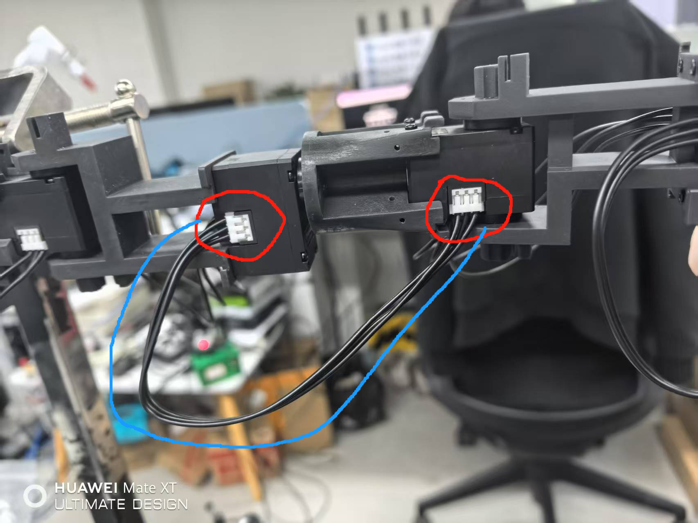
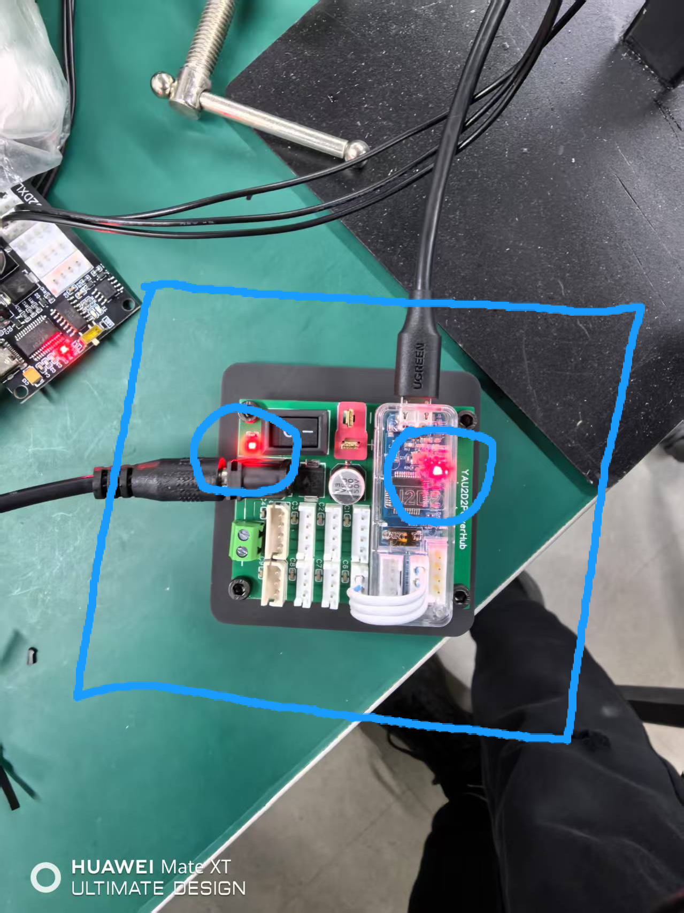
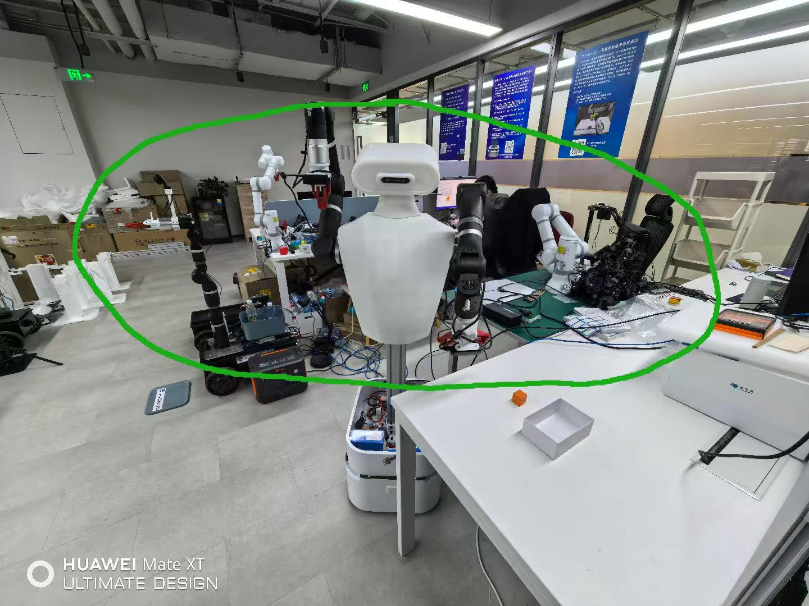
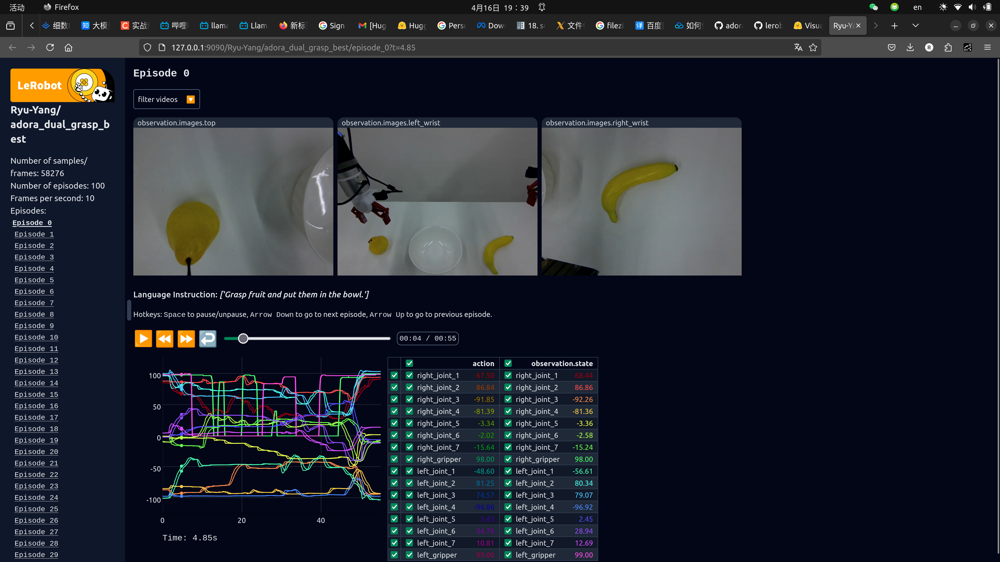

# 通过LeRobot使用[Adora](https://github.com/Ryu-Yang/adora-robot/blob/main/README_zh.md)机器人复现ACT

## 目录表

  - [A. 硬件准备](#a-硬件准备)
  - [B. 安装Adora-LeRobot](#b-安装-adora-lerobot)
  - [C. 启动并配置硬件](#c-启动并配置硬件)
  - [D. 启动遥操作](#d-启动遥操作)
  - [E. 采集数据集](#e-采集数据集)
  - [F. 可视化数据集](#f-可视化数据集)
  - [G. 训练模型](#g-训练模型)
  - [H. 推理模型](#h-推理模型)
  - [I. 更多信息](#i-更多信息)

## A. 硬件准备

**机器人** 

- Adora - [操作手册](https://github.com/Ryu-Yang/adora-robot)

**采集推理平台**

> 根据情况，选其一即可。系统Ubuntu22.04

- 自带Nidia显卡的个人计算机（推荐20系往上、显存8GB往上）
- Jetson Orin NX

**训练平台**

> 根据选其一即可。系统Ubuntu22.04

- 自带Nidia显卡的个人计算机（训练ACT、DP模型推荐使用16GB显存往上）
- AutoDL（训练pi0时需要租用H800 80G/A800 80G等80G左右显存的卡来训练）

**其他**

- 一个背景光照变化不大且能容纳下机器人的场地。

- 操作用的桌子和操作的道具(水果之类)

## B. 安装 Adora LeRobot

> [!TIP]
> 我们会用到很多命令行操作 (cmd)。如果您不太擅长使用可以参考这里：[Command line crash course](https://developer.mozilla.org/en-US/docs/Learn_web_development/Getting_started/Environment_setup/Command_line)

在您的计算机或Jetson上:

#### 1. [安装 Miniconda](https://docs.anaconda.com/miniconda/install/#quick-command-line-install):

#### 2. 重启终端

在您的终端输入: 

```bash
source ~/.bashrc
```

#### 3. 为 LeRobot 创建并激活新的 conda 环境

运行以下命令创建 Python 3.10 环境：
```bash
conda create -y -n lerobot python=3.10
```

激活 conda 环境（每次使用 LeRobot 前都需要执行）：
```bash
conda activate lerobot
```

#### 4. 克隆 Adora-LeRobot 仓库：

```bash
git clone https://github.com/Ryu-Yang/adora-lerobot.git
```

#### 5. 安装 Adora-LeRobot LeRobot：

```bash
cd adora-lerobot && pip install .
```

```bash
conda install -y -c conda-forge "opencv>=4.10.0"
```

太棒了！至此已完成 Adora-LeRobot 的安装，接下来可以开始启动Adora机器人。

## C. 启动并配置硬件

您可以参考[Adora机器人操作手册](https://github.com/Ryu-Yang/adora-robot/blob/main/README_zh.md)准备您的Adora机器人。

adora机器人如下图。


其领导臂（遥操臂）如下图


请检查其线束是否连接正常或发生了缠绕。如下图所示，红色圈内为线束连接处，两红色圈之间的黑色连接线应当和蓝色线一样能够在两个红色圈之间形成一道弧线。



#### 启动并正常上电

开关位于adora机器人底盘后方蓝色圈内，如下图。


确认领导臂双臂的供电正常。需要确认两块如下图所示的控制板上的供电灯和信号灯都亮



#### 确保 跟随臂 活动空间安全

请确保机械臂（跟随臂）在下面图中，绿色圈出的范围内无障碍物



### 接口连接

Adora底盘引出了两个USB接口，需要插入您的电脑或JETSON。
同时底盘有一网口，需要连接您的电脑或JETSON。

#### 摄像头及USB编号复位

将左右手腕及头部摄像头的USB转接线与接口断开连接，都断开后等待3秒。然后从左到右重新插上连接，顺序为 `左手腕摄像头` -> `头部摄像头` -> `右手腕摄像头` 

将领导臂的左右两个控制器的USB连接断开3秒后，从右往左依次再次插上。

#### 启动初始命令

在linux中，您需要给USB权限:
```bash
sudo chmod 777 /dev/ttyUSB0
sudo chmod 777 /dev/ttyUSB1
```

## D. 启动遥操作

#### Adora机器人程序流程

`程序启动` -> `右臂初始校准位置归位` -> `左臂初始校准位置归位` -> `遥操作` -> `Ctrl+C结束`

程序启动后，领导臂右臂首先会进入初始位置校准模式，将会有原本没有上电的松散状态转变为带有力度输出的姿态保持模式。

您可以用双手将其调整至初始校准位置（见后文），确认位置无误后，按下键盘Q键或踩脚踏板然后再按捏一下末端扳机，接下来便会看到跟随臂移动到和领导臂一样的位置，这样便完成了右臂的初始校准位置归位。

初始校准位置如下图所示。（需要双臂都如图所示）（启动时需要保持在该位置）（需确保贴标签的一面朝上）

然后使用同样的方法完成左臂初始位置归位。注意：左臂捏扳机前，确保领导臂双臂以及拿在手上，因为捏下左扳机后就会进入下一阶段遥操作了。

#### 启动

您可以启动下面的命令开始遥操作：

```bash
python lerobot/scripts/control_robot.py \
  --robot.type=adora_dual \
  --control.type=teleoperate
```

## E. 采集数据集

当您熟悉了遥操作后，您便可以尝试使用Adora开始第一次数据采集了。

如果您想使用HuggingFace Hub来上传并保存您的数据集，而您之前并没有这么做过。请确认您已经登录了Huggingace，倘若没有登录，请参考下面的命令，其中token可以在[Hugging Face settings](https://huggingface.co/settings/tokens)生成。

```bash
huggingface-cli login --token ${HUGGINGFACE_TOKEN} --add-to-git-credential
```

将您的Hugging Face 用户名称存储在命令行的变量中:

```bash
HF_USER=$(huggingface-cli whoami | head -n 1)
echo $HF_USER
```

您可以先采集2条来测试：

```bash
python lerobot/scripts/control_robot.py \
  --robot.type=adora_dual \
  --control.type=record \
  --control.fps=10 \
  --control.single_task="Grasp a lego block and put it in the bin." \
  --control.repo_id=${HF_USER}/adora_dual_test \
  --control.tags='["adora_dual","tutorial"]' \
  --control.warmup_time_s=240 \
  --control.episode_time_s=240 \
  --control.reset_time_s=240 \
  --control.num_episodes=2 \
  --control.push_to_hub=false
```

> 注意: 您可以加上 `--control.resume=true` 以便从上次采集断掉的点开始采。如果您想把数据上传HuggingFace，可以将`--control.push_to_hub=false` 的false改为true。

查看采集的数据, 可以参考下一章，查看地址为`http://127.0.0.1:9090`:
```bash
python lerobot/scripts/visualize_dataset_html.py \
  --repo-id ${HF_USER}/adora_dual_test \
```

采集50条数据用于模型训练：

```bash
python lerobot/scripts/control_robot.py \
  --robot.type=adora_dual \
  --control.type=record \
  --control.fps=10 \
  --control.single_task="Grasp fruit." \
  --control.repo_id=${HF_USER}/adora_dual_grasp_fruit \
  --control.tags='["adora_dual","tutorial"]' \
  --control.warmup_time_s=240 \
  --control.episode_time_s=240 \
  --control.reset_time_s=240 \
  --control.num_episodes=50 \
  --control.push_to_hub=false
```


## F. 可视化数据集

您可以在本地浏览器内参看您的数据集：`http://127.0.0.1:9090`，通过启动下面的命令：

```bash
python lerobot/scripts/visualize_dataset_html.py \
  --repo-id ${HF_USER}/adora_dual_grasp_fruit \
```

> 您可以将 `--repo-id` 的参数换为其他数据集

查看页面如下：




如果您还将您的数据集上传了HuggingFace Hub通过在采集时带上 `--control.push_to_hub=true` 参数。 您可以在[visualize your dataset online](https://huggingface.co/spaces/lerobot/visualize_dataset)线上查看您的数据集。您可以通过下面的命令获取您的数据集仓库名称，然后将其复制并输入到该在线网页中，然后回车查看。

```bash
echo ${HF_USER}/adora_dual_grasp_fruit
```

> 您可以改变其名称，将其换为其他数据集

## G. 训练模型

为了训练一个策略来控制您的机器人，您可以使用[`python lerobot/scripts/train.py`](../lerobot/scripts/train.py)脚本。只需要少量的参数，示例如下：

```bash
python lerobot/scripts/train.py \
  --dataset.repo_id=${HF_USER}/adora_dual_grasp_fruit \
  --policy.type=act \
  --output_dir=outputs/train/act_adora_dual_grasp_fruit \
  --job_name=act_adora_dual_grasp_fruit \
  --policy.device=cuda \
  --wandb.enable=true
```

解释如下：
1. 使用 `--dataset.repo_id=${HF_USER}/adora_dual_grasp_fruit` 来选择训练用的数据集。
2. 使用 `policy.type=act` 来决定训练的策略. 这将加载 [`configuration_act.py`](../lerobot/common/policies/act/configuration_act.py)的配置。 重要的是，此策略将自动适应机器人的电动机数量，电动机动作和相机的数量，这些数量已保存在数据集中。
4. 使用 `policy.device=cuda` 在 Nvidia GPU上训练。 如果在Apple的芯片上训练，您可以使用 `policy.device=mps`。华为昇腾正在适配中 `policy.device=cann`
5. 如果您想使用[Weights and Biases](https://docs.wandb.ai/quickstart)来可视化您的训练输出，请使用`wandb.enable=true`。本功能是可选的，如果您要使用，请确认已经通过`wandb login`登录。国产SwanLab正在适配中。
6. 多卡训练正在开发中。

训练会花费不少时间。训练完成后，您可以找到checkpoints在`outputs/train/adora_dual_grasp_fruit/checkpoints`内。在推理时，您需要指定该policy checkpoint路径。

## H. 推理模型

方法一：您可以使用[`lerobot/scripts/control_robot.py`](../lerobot/scripts/control_robot.py)内的`record`函数。在传入参数时指定policy checkpoint，该函数便会执行推理。

方法二：您也可以直接使用下面的命令开始10次推理，并记录10次推理过程：

```bash
python lerobot/scripts/control_robot.py \
  --robot.type=adora_dual \
  --control.type=record \
  --control.fps=10 \
  --control.single_task="Grasp fruit." \
  --control.repo_id=${HF_USER}/eval_act_adora_dual_grasp_fruit \
  --control.tags='["tutorial"]' \
  --control.warmup_time_s=240 \
  --control.episode_time_s=240 \
  --control.reset_time_s=240 \
  --control.num_episodes=10 \
  --control.push_to_hub=false \
  --control.policy.path=outputs/train/act_adora_dual_grasp_fruit/checkpoints/last/pretrained_model
```

如您所见，它与以前用于采集数据集的命令几乎是相同的命令。只有两件事改变了：

1.还有一个附加的`--control.policy.path`参数，该参数指示您的模型的checkpoint路径（例如`outputs/train/act_adora_dual_grasp_fruit/checkpoints/last/pretrained_model`）。
如果已将模型检查点上传到hub（例如`$ {HF_USER}/act_adora_dual_grasp_fruit`），也可以使用该hub仓库。

2.推理过程中，会产生一个记录推理过程的数据集，该数据集的名称以`eval`开头，以反映您正在运行推理（例如`$ {HF_USER}/eval_act_adora_dual_grasp_fruit`）。

## I. 更多信息

请遵循[LeRobot官方的旧教程](https://github.com/huggingface/lerobot/blob/main/examples/7_get_started_with_real_robot.md#4-train-a-policy-on-your-data)，以获取有关使用Lerobot控制真实机器人的更深入的教程。

> [!TIP]
>  If you have any questions or need help, please reach out on issues.
